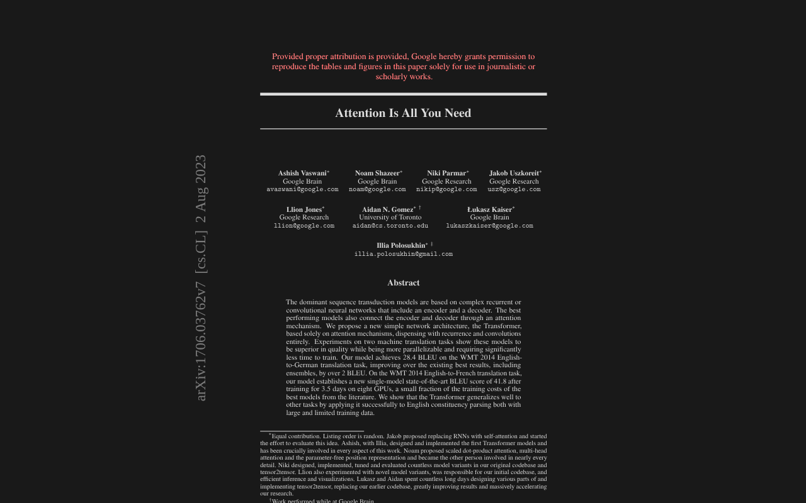
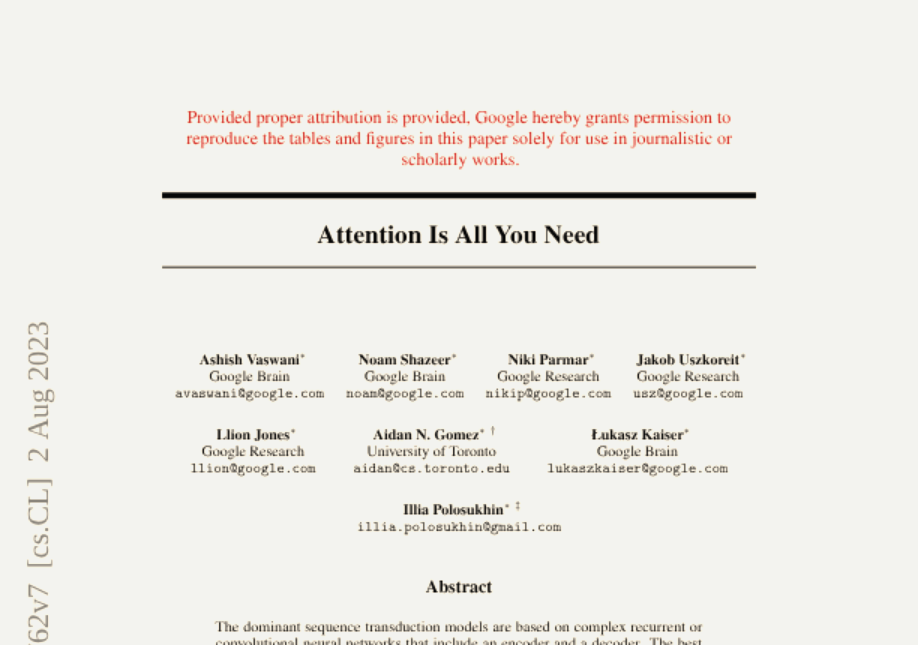
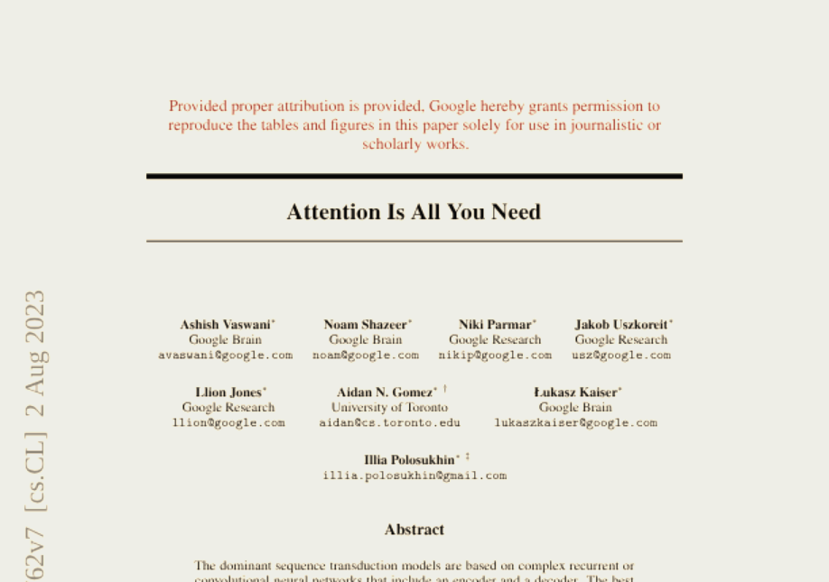
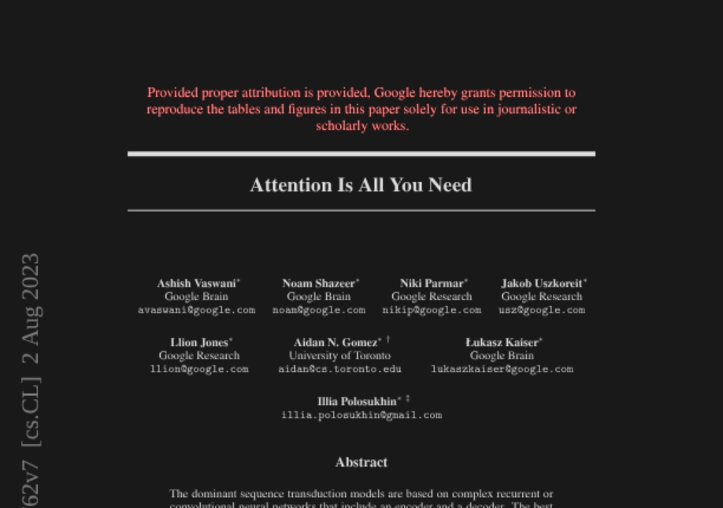
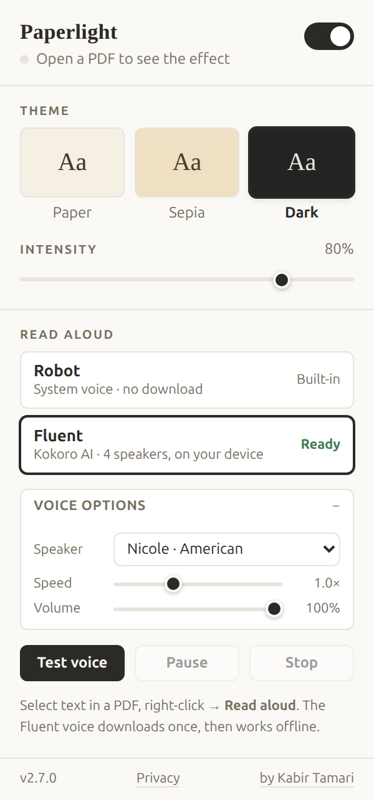
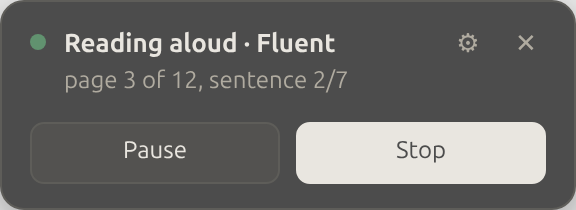

<div align="center">


# Paperlight

### PDF dark mode, sepia and paper themes, plus read aloud

Chrome's PDF viewer is a wall of glaring white. Paperlight softens it into
something you can read for an hour, then reads it out loud to you if your eyes
have had enough.

[](https://developer.chrome.com/docs/extensions)
[](https://developer.chrome.com/docs/extensions/develop/migrate)
[](PRIVACY.md)
[](PRIVACY.md)



</div>

---

## Three ways to read

Pick a mood, then slide the intensity from barely-there to full strength. The
change lands instantly, with no page reload.

<div align="center">

| Paper | Sepia | Dark |
|:---:|:---:|:---:|
|  |  |  |
| A soft cream tint, blacks lifted just enough | A warmer, old-book tone | Charcoal pages, off-white ink, images kept close to true |

</div>

## Let it read to you

Select any text, right-click, choose **Read aloud**. Or hand it the whole
document and go make coffee.

<div align="center">

 &nbsp;&nbsp; 

</div>

Two voices to choose from:

| | Sounds like | Download | Runs |
|---|---|---|---|
| **Robot** | Your operating system's built-in voice | Nothing | Instantly |
| **Fluent** | A real person, four of them | 90 MB, once | On your own CPU, offline afterwards |

Fluent is [Kokoro-82M](https://huggingface.co/onnx-community/Kokoro-82M-v1.0-ONNX),
a small neural speech model that runs inside your browser. Meet the cast:

**Nicole** and **Santa** (American), **Isabella** and **George** (British).

Set the speed anywhere from 0.5x to 2x, adjust the volume, and change your mind
mid-sentence. The next sentence picks up the new settings.

## Nice touches

**It stays out of the way.** Paperlight only wakes up on actual PDF documents.
Normal websites are never touched, never styled, never read.

**It works when the popup does not.** Chrome slams the toolbar popup shut the
moment you click the page. So every control also lives inside the PDF itself:
a small launcher in the corner opens the full settings panel, and a compact
card shows progress with Pause and Stop while something is being read.

**It tells you what it is doing.** The toolbar icon shows a badge even with
everything closed: `42%` while downloading, `…` while generating, `▶` while
speaking, `⏸` while paused.

**It remembers.** Your theme, intensity, voice, and speed follow your Chrome
profile across devices.

**It never phones home.** No account, no analytics, no server. After the
one-time voice download, read aloud works with the network off.
See [PRIVACY.md](PRIVACY.md).

## Install

Paperlight is not on the Chrome Web Store yet. To run it now:

```bash
git clone https://github.com/kabir0st/paperlight.git
```

1. Open `chrome://extensions` in Chrome
2. Turn on **Developer mode** (top-right toggle)
3. Click **Load unpacked** and pick the `paperlight` folder
4. Pin Paperlight from the puzzle-piece menu so it is one click away

> **Reading PDFs saved on your computer?** Open the extension's details page and
> switch on **Allow access to file URLs**.

## Using it

Open a PDF, click the Paperlight icon, flip the switch on. Pick a theme, drag
the intensity slider, done. The popup also tells you whether the current tab is
actually a PDF.

For read aloud:

1. Choose **Robot** or **Fluent** in the popup. Fluent downloads once, with a
   progress bar, and is cached forever after.
2. Hit **Test voice** to hear it.
3. Select text in any PDF, right-click, choose **Read aloud**.
4. Or read the whole thing: on a PDF tab the popup shows **Read this PDF**, with
   a *from page* box if you want to skip the front matter. It is in the
   right-click menu too.
5. Prefer to stay in the page? Click the launcher in the bottom-right corner.
   Same controls, and unlike the popup it stays put when you click away.

## Good to know

- Depending on your Chrome version, the viewer's own toolbar may pick up the
  tint. On current Chromium it stays native.
- Images are filtered along with the page. Dark mode rotates hues after
  inverting to keep colors roughly right, but photos will not be pixel-perfect.
- Sites with their own JavaScript PDF readers are not Chrome's viewer, so they
  are unaffected.
- Fluent speaks English only, American and British. It runs on the CPU, so it
  works everywhere, just slower on older machines.
- The Robot voice is only as good as your operating system's speech engine. On
  Linux that is usually espeak-ng, which is very robotic.
- Needs Chrome 116 or newer for read aloud.

## If something goes wrong

| Symptom | Fix |
|---|---|
| Nothing happens on a PDF | Refresh the tab once after installing or updating |
| Nothing happens on a local file | Turn on *Allow access to file URLs* in the extension's details |
| Popup says "Open a PDF to see the effect" | The current tab is not a PDF. Paperlight only acts on PDFs |
| Settings do not sync between machines | Sign into Chrome. Downloaded voices stay per-machine either way |
| "Read aloud" missing from the right-click menu | It only appears when text is selected. Reload the extension after updating |
| Read aloud stops with an audio error | The browser suspended playback. Press Stop, then start again |
| Read aloud does nothing on a PDF | The pages are probably scans, so there is no text to read. If you cannot select the text by hand, neither can Paperlight |
| Your speaker or the engine picker vanished | Version 2.7.0 removed the experimental WebGPU engine and narrowed the speaker list to four. Updating moves you to Nicole and reclaims the unused download |

## For developers

Architecture notes, the reasoning behind the filter approach, and the project
layout live in [ARCHITECTURE.md](ARCHITECTURE.md).

```bash
npm install
npm run build
```

### Permissions, and why

| Permission | Why |
|---|---|
| `storage` | Remember your theme, intensity, and voice |
| Host access (`<all_urls>`) | PDFs live at unpredictable URLs, so the detector has to be allowed to load anywhere. It exits immediately on anything that is not a PDF |
| `contextMenus` | The right-click **Read aloud** item |
| `tts` | The Robot voice |
| `offscreen` | A hidden page that runs the Fluent voice and plays audio |

## Privacy

No accounts, no analytics, no servers, nothing sold or shared. Full details of
every stored value and every network request are in [PRIVACY.md](PRIVACY.md).

One caveat worth repeating here: the **Robot** voice hands your text to Chrome's
own speech API, which on some platforms synthesizes over the network. The
**Fluent** voice runs entirely on your CPU and transmits nothing.

## License

ISC, as declared in `package.json`. Use, modify, and distribute freely.
The vendored `src/vendor/phonemize.js` comes from
[kokoro-js](https://github.com/hexgrad/kokoro) under Apache-2.0.

---

<div align="center">

Built by [Kabir Tamari](https://kabirtamari.com/)

</div>
