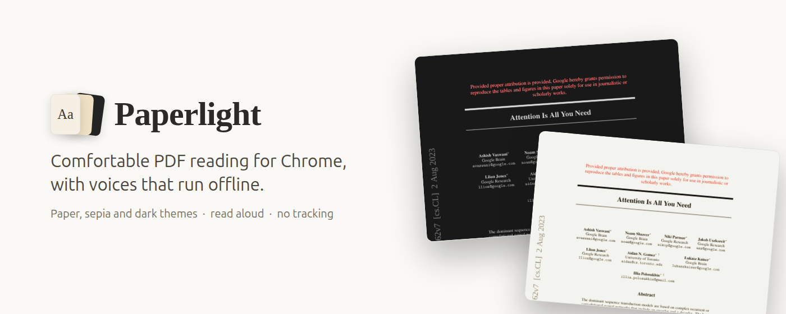
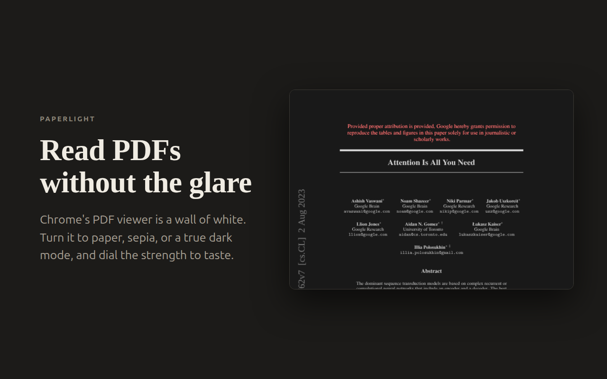
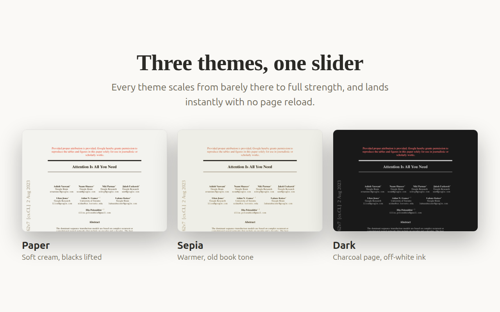
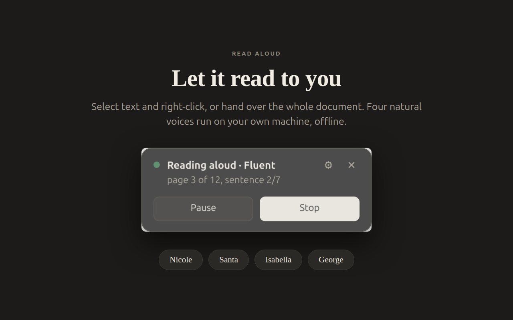
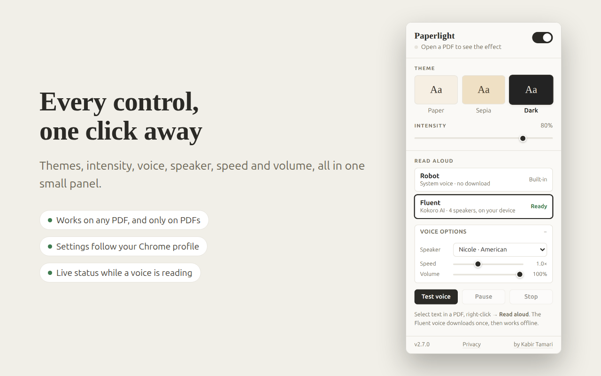
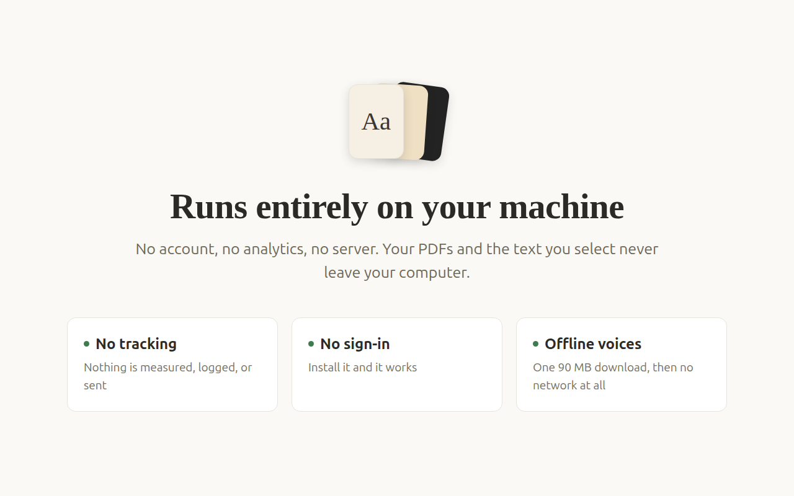

Chrome's PDF viewer is a wall of glaring white. Paperlight softens it into
something you can read for an hour, then reads it out loud to you if your eyes
have had enough.

The change lands the moment you flip the switch. No page reload, no re-opening
the document.

## Pick a mood

One slider takes each theme from barely-there to full strength, so you can match
the room you are actually sitting in.

## Voices

Select any text, right-click, choose **Read aloud**. Or hand it the whole
document and go make coffee. There are two voices:

| | Sounds like | Download | Runs |
|---|---|---|---|
| **Robot** | Your operating system's built-in voice | Nothing | Instantly |
| **Fluent** | A real person, four of them | 90 MB, once | On your own CPU, offline afterwards |

Fluent is [Kokoro-82M](https://huggingface.co/onnx-community/Kokoro-82M-v1.0-ONNX),
a small neural speech model that runs inside your browser. The cast:
**Nicole** and **Santa** (American), **Isabella** and **George** (British).

Set the speed anywhere from 0.5x to 2x, adjust the volume, and change your mind
mid-sentence — the next sentence picks up the new settings.

## The controls

Chrome slams the toolbar popup shut the moment you click the page, so every
control also lives *inside* the PDF: a small launcher in the corner opens the
same settings panel, and it stays put when you click away.

You can also read the extension at a glance. The toolbar icon shows a badge even
with everything closed — `42%` while downloading, `…` while generating, `▶`
while speaking, `⏸` while paused. Your theme, intensity, voice and speed follow
your Chrome profile across devices.

## Privacy

No account, no analytics, no server. After the one-time Fluent download, read
aloud works with the network off entirely.

One caveat worth stating plainly: the **Robot** voice hands your text to Chrome's
own speech API, which on some platforms synthesizes over the network. The
**Fluent** voice runs on your CPU and transmits nothing. Every stored value and
every network request is listed in [PRIVACY.md](PRIVACY.md).

## Get it

1. Open a PDF
2. Click the Paperlight icon and flip the switch on
3. Pick a theme, drag the intensity slider, done

For read aloud, choose **Robot** or **Fluent** in the popup — Fluent downloads
once, with a progress bar, and is cached forever after. Then select text in any
PDF and right-click, or use **Read this PDF** to play the whole document.

> **Reading PDFs saved on your computer?** Open the extension's details page and
> switch on **Allow access to file URLs**.

---

[Troubleshooting](docs/TROUBLESHOOTING.md) &nbsp;·&nbsp;
[Privacy](PRIVACY.md) &nbsp;·&nbsp;
[How it works](ARCHITECTURE.md)

ISC licensed. The vendored `src/vendor/phonemize.js` comes from
[kokoro-js](https://github.com/hexgrad/kokoro) under Apache-2.0.

Built by [Kabir Tamari](https://kabirtamari.com/)

